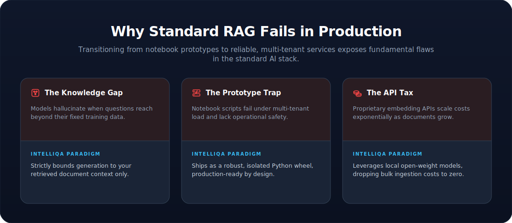
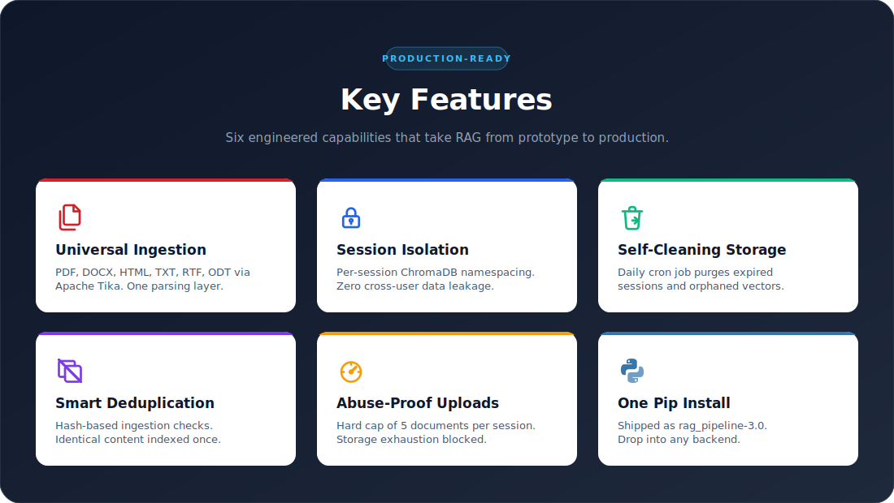
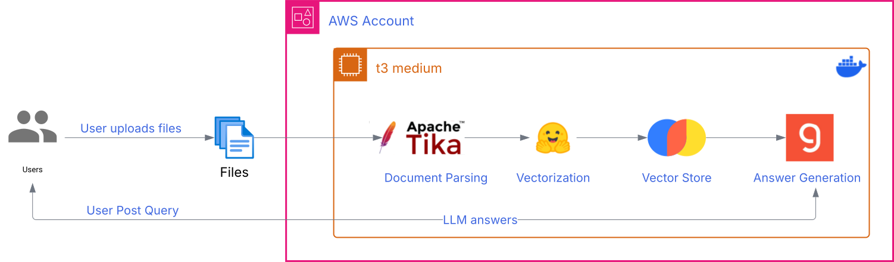
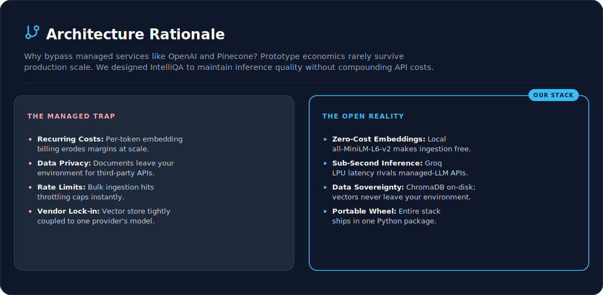

# IntelliQA: Document-Grounded RAG System

<p align="center">
  <a href="https://theanalyticmind.com/projects/intelliqa/">
    
  </a>
  
</p>

## System Overview

IntelliQA is a **production-oriented Retrieval Augmented Generation (RAG) backend** for grounded question answering over private documents. Core logic ships as a Python wheel so the same package can power a notebook demo today and an API service tomorrow without rewrites.

> The driving question: **how do you make LLM answers reliable, multi-tenant, and operationally sustainable on private documents?**

## Problem Statement

<p align="center">
  
</p>

## TL;DR

IntelliQA is a packaged RAG backend that directly addresses each of the failure modes above. Sessions are **isolated** (no cross-user leakage), capped at **5 uploads** (abuse prevention), content is **deduplicated** at ingestion, and a **scheduled cron job** manages disk space. Generation runs on **Llama 3.3 70B via Groq** against a persistent **ChromaDB** store. Retrieval quality is measured by a dedicated **RAGAS evaluation harness** (baseline established, retrieval tuning in progress). Shipped as the `rag_pipeline` Python wheel and powering the live demo at [theanalyticmind.com/projects/intelliqa](https://theanalyticmind.com/projects/intelliqa/).

## 🛠️ Tech Stack

<div align="center">

| | |
|:---|:---|
| **LLM & Inference** | ![Llama 3.3 70B][llama] ![Groq LPU][groq] |
| **Embeddings** | ![Hugging Face][hf] ![all-MiniLM-L6-v2][minilm] |
| **RAG Framework** | ![LangChain][langchain] ![ChromaDB][chroma] |
| **Document Parsing** | ![Apache Tika][tika] |
| **Evaluation** | ![Ragas][ragas] ![Ollama][ollama] ![Qwen2.5][qwen] ![Gemini][gemini] |
| **Deployment** | ![Docker][docker] ![AWS EC2][ec2] |
| **Packaging** | ![setup.py + wheel][wheel] |
| **Language** | ![Python][python] ![Jupyter][jupyter] |

</div>

[llama]: https://img.shields.io/badge/Llama_3.3_70B-0467DF?style=for-the-badge&logo=meta&logoColor=white
[groq]: https://img.shields.io/badge/Groq_LPU-F55036?style=for-the-badge&logo=lightning&logoColor=white
[hf]: https://img.shields.io/badge/Hugging_Face-FFD21E?style=for-the-badge&logo=huggingface&logoColor=black
[minilm]: https://img.shields.io/badge/all--MiniLM--L6--v2-6E6E6E?style=for-the-badge&logo=pytorch&logoColor=white
[langchain]: https://img.shields.io/badge/LangChain-1C3C3C?style=for-the-badge&logo=chainlink&logoColor=white
[chroma]: https://img.shields.io/badge/ChromaDB-FF6B6B?style=for-the-badge&logo=databricks&logoColor=white
[tika]: https://img.shields.io/badge/Apache_Tika-D22128?style=for-the-badge&logo=apache&logoColor=white
[ragas]: https://img.shields.io/badge/Ragas-6E56CF?style=for-the-badge&logoColor=white
[ollama]: https://img.shields.io/badge/Ollama-000000?style=for-the-badge&logo=ollama&logoColor=white
[qwen]: https://img.shields.io/badge/qwen2.5-615CED?style=for-the-badge&logo=qwen&logoColor=white
[gemini]: https://img.shields.io/badge/Gemini_Flash--Lite-1C69FF?style=for-the-badge&logo=googlegemini&logoColor=white
[docker]: https://img.shields.io/badge/Docker-2496ED?style=for-the-badge&logo=docker&logoColor=white
[ec2]: https://img.shields.io/badge/AWS_EC2-FF9900?style=for-the-badge&logo=amazonaws&logoColor=white
[wheel]: https://img.shields.io/badge/setup.py_%2B_wheel-3776AB?style=for-the-badge&logo=pypi&logoColor=white
[python]: https://img.shields.io/badge/Python-3776AB?style=for-the-badge&logo=python&logoColor=white
[jupyter]: https://img.shields.io/badge/Jupyter-F37626?style=for-the-badge&logo=jupyter&logoColor=white


## ✨ Key Features

<p align="center">
  
</p>

## 🧠 System Design Philosophy

**1. Grounded Generation.** LLM runs at `temperature=0` and answers only from retrieved chunks. No speculation.

**2. Multi-Tenant Isolation.** Documents and queries are namespaced per session. Each user retrieves only from their own uploads.

**3. Operational Discipline.** Upload quotas, scheduled cleanup, and deduplication are first-class features, not afterthoughts.

**4. Package-First Distribution.** Core RAG logic ships as a Python wheel. The notebook is a demo. The wheel is the product, and it powers the live portfolio site.

**5. Honest Boundaries.** The system can fail in known ways: retrieval misses, ambiguous source documents, questions outside the indexed content. Design decisions surface these failure modes rather than hide them. `temperature=0` is for reproducibility, not zero hallucination; the prompt instructs the model to say "I don't know" when retrieved context is insufficient. These failure modes are not just asserted — they are **measured** (see Evaluation).

## 🏗️ How RAG Works in IntelliQA

At a high level, IntelliQA wraps four functional stages into one installable pipeline: a parser converts documents to text, an embedder converts text to vectors, a vector store holds them for similarity search, and an LLM generates answers grounded in the retrieved chunks.

<p align="center">
  
</p>

## 🏗️ System Architecture

The real system adds operational layers around the RAG core. Four layers in total:

**Ingestion** &nbsp;·&nbsp; Apache Tika parses multi-format input; deduplication and chunking happen before vectors touch the store.

**Storage** &nbsp;·&nbsp; ChromaDB persists 384-dimensional vectors from `all-MiniLM-L6-v2`, namespaced by session.

**Generation** &nbsp;·&nbsp; Llama 3.3 70B Versatile (served on Groq LPU) generates answers bounded to retrieved context.

**Operations** &nbsp;·&nbsp; Session lifecycle, per-session upload quotas, and a daily cron job for cleanup.

<p align="center">
  
</p>

## 🧠 Design Decision: Open Stack Over Managed APIs

<p align="center">
  
</p>

## 🛠️ Challenges & Lessons Learned

A few real engineering hurdles surfaced during the IntelliQA build that shaped the current architecture.

### 1. Apache Tika JVM warm-up cost

Tika runs on the JVM, and spawning a fresh JVM per request caused unacceptable cold-start latency on first document upload. The fix was to run a long-lived Tika server on EC2 and proxy requests to it, reducing parse time from seconds to milliseconds. Tika is fast when warm, but slow if treated like a CLI tool.

---

### 2. Disk pressure on shared EC2

The same EC2 instance hosts both the portfolio site and IntelliQA. Without lifecycle management, ChromaDB storage would grow unbounded and Tika temp files would accumulate. This directly led to a cron-based cleanup approach instead of relying on managed storage. Lesson: shared infrastructure requires explicit cleanup design.

---

### 3. Embedding model trade-off

`all-MiniLM-L6-v2` (384 dims) was chosen over larger models like `bge-large-en` (1024 dims) despite lower accuracy. The trade-off was CPU efficiency, no API cost, and a smaller vector store. Performance is sufficient for most Q&A tasks, but worth revisiting if retrieval quality drops.

---

### 4. Hallucination outside retrieved context

Even at temperature=0, the LLM occasionally answered from training data when retrieved context was weak. Updating the system prompt to enforce <span style="color:#ff7f50;"> answer only from the provided context; if the context does not contain the answer, say so </span> reduced this significantly. This reflects the _Honest Boundaries_ design principle.

---

### 5. Clean extraction is a retrieval concern, not cosmetics

Raw Tika output carried structural noise - tabs, non-breaking spaces, and PDF hyphenation splits (e.g. `vesi-\ncles`). Beyond wasting tokens, split words fail to match at retrieval time. Normalizing extracted text before chunking is a small change with a direct effect on embedding quality, surfaced only because the evaluation harness made retrieval failures visible.

## 🚀 Installation & Usage

### Option 1: Install the Prebuilt Wheel
*Use this if you want IntelliQA as a ready-to-use RAG backend in your own application.* This is the path used by the live portfolio site.

```bash
git clone https://github.com/abhijitdeshpande83/IntelliQA-RAG-Powered-Document-Intelligence.git
cd IntelliQA-RAG-Powered-Document-Intelligence
pip install dist/rag_pipeline-3.1-py3-none-any.whl
export GROQ_API_KEY="groq-key-here"
```

Import and use anywhere:

```python
from rag_pipeline import query_engine, vector_store, utils, is_supported_file
```

The package exposes three modules:

- `rag_pipeline.utils`: parsing, chunking, deduplication
- `rag_pipeline.vector_store`: Chroma setup and indexing
- `rag_pipeline.query_engine`: retrieval, prompt assembly, generation
- `rag_pipeline.is_supported_file`: checks if a file type is supported for RAG ingestion

See `IntelliQA.ipynb` for end-to-end usage examples.

### Option 2: Install from Source
*Use this if you want to read, modify, or extend the core RAG logic.* The editable install (`pip install -e .`) picks up source changes immediately without reinstalling.

```bash
git clone https://github.com/abhijitdeshpande83/IntelliQA-RAG-Powered-Document-Intelligence.git
cd IntelliQA-RAG-Powered-Document-Intelligence

python -m venv venv
source venv/bin/activate              # Windows: venv\Scripts\activate

pip install -r requirements.txt
pip install -e .

export GROQ_API_KEY="groq-key-here"
jupyter notebook IntelliQA.ipynb
```

## 🚧 Current Status

|  |  |
| --- | --- |
| **Shipped** | Core pipeline, session isolation, upload quota, scheduled cleanup, AWS EC2 deployment, `rag_pipeline-3.1` wheel, RAGAS evaluation harness + baseline |
| **In progress** | Retrieval tuning guided by eval findings — document-scoped retrieval, hybrid search, and reranking |

## 📏 Evaluation

RAG quality is measured with a dedicated [RAGAS](https://github.com/explodinggradients/ragas) harness built around four retrieval-and-generation metrics rather than generic LLM benchmarks. The goal is not a single headline score but a **repeatable way to locate where the pipeline succeeds or fails**, so component changes (chunk size, retrieval `k`, embeddings, reranking) can be compared against a fixed baseline.

### Metrics

- **Faithfulness** &nbsp;·&nbsp; Does the answer follow from the retrieved chunks, or does the model introduce unsupported claims? *(generation grounding)*
- **Answer Relevancy** &nbsp;·&nbsp; Does the response actually address the question asked? *(generation quality)*
- **Context Precision** &nbsp;·&nbsp; Of the chunks retrieved, what fraction are relevant? *(retrieval ranking)*
- **Context Recall** &nbsp;·&nbsp; Of the chunks needed to answer, how many were retrieved? *(retrieval coverage)*

### Harness

The evaluation set is **32 synthetic question-answer pairs** generated with the RAGAS `TestsetGenerator` over a deliberately diverse corpus - financial filings (10-K / 8-K), tax publications, a commercial legal agreement, and academic papers - to mirror the arbitrary documents a real user might upload. Each question is answered by the live pipeline, and the **retrieved chunks, generated answer, and reference answer** are scored by an LLM-as-judge.

> **Infrastructure note.** Test-set generation is a heavy, one-time batch - RAGAS builds a knowledge graph with several LLM calls per chunk, so cost scales with the *documents fed in*, not the number of questions requested. Running this on free-tier hosted models repeatedly hit per-minute and per-day token limits. The resolution was a deliberate split: **local Ollama (`qwen2.5`)** for the uncapped batch generation, and a **free, higher-quota hosted judge (Gemini Flash-Lite)** for scoring. Matching the model to the job is itself a cost lesson baked into the harness.

### Baseline Results (32 questions, `k = 4`)

| Metric | Score | Reads as |
|:---|:---:|:---|
| **Faithfulness** | `0.75` | Generation is sound - answers stay grounded in retrieved context |
| **Answer Relevancy** | `0.63` | Mostly on-topic; partly lowered by *correct* "I don't know" refusals |
| **Context Precision** | `0.32` | Retrieval pulls noticeable noise alongside relevant chunks |
| **Context Recall** | `0.38` | Retrieval often misses the chunk that holds the answer |

### What the Baseline Revealed

The metric **shape** - high faithfulness, low recall and precision - points cleanly at one conclusion: **generation is healthy, retrieval is the bottleneck.** The model uses what it is given faithfully; it is simply being handed the wrong or incomplete chunks.

Diagnosing further, changing **one variable at a time**:

- **Raising retrieval `k` from 4 → 8 did not change recall** (held at `0.375`, while precision *dropped*). More chunks did not help - so the answer-bearing chunk is not merely ranked just outside the cutoff, it is genuinely not being matched. `k` is not the lever.
- **The dominant failure mode is question ambiguity over near-identical documents.** The corpus holds many highly similar financial filings, and the generated questions are phrased only against their source chunk without naming the company - e.g. "what is the unrecognized tax benefit?" when several filings each contain one. Neither the user nor the retriever can tell which document is meant, so correct retrieval is near-impossible by construction. The fix is question specificity and document-scoped retrieval, not more chunks.
- **Data hygiene helped, but was not the main lever.** Excluding CSVs (which exploded into thousands of low-value chunks) and cleaning extraction artifacts improved input quality and token cost - but recall barely moved, consistent with the failure being *question ambiguity* rather than noisy text.

### Next Steps - Retrieval Tuning (in progress)

The diagnosis directs the remaining work toward retrieval, not generation:

1. **Test-set specificity** - separating how real users phrase questions (specific vs. ambiguous) and measuring each mode on its own.
2. **Hybrid retrieval (BM25 + dense)** - to catch exact-term misses (e.g. defined acronyms) that pure semantic search drops.
3. **Cross-encoder reranking** - retrieve wide for recall, rerank to keep a precise top-`k`.

> This is a **baseline, not a final result.** The value of the harness is that every tuning step above can now be **measured against the table** rather than guessed at - change one variable, re-score, attribute the difference.

## 🚫 Out of Scope

A few capabilities are explicitly **not** part of IntelliQA's design. These are deliberate non-goals, not gaps:

- **User authentication.** Sessions are isolated by ID; authentication and user-account management are the responsibility of the calling application. IntelliQA is a backend, not a SaaS product.
- **Long-term knowledge accumulation.** Each session is ephemeral. IntelliQA does not build a persistent knowledge base across users or across time. Documents are scoped to the session that uploaded them and are subject to scheduled cleanup.
- **Document editing or partial updates.** Modifying an indexed document requires re-uploading it. There is no in-place edit path.

## 🚀 Future Improvements

Several of these are now **evidence-backed by the evaluation findings** rather than speculative:

- **Hybrid retrieval (BM25 + dense vector)** - targets the exact-term retrieval misses observed in the baseline.
- **Cross-encoder reranking on retrieved chunks** - decouples recall (retrieve wide) from precision (keep a reranked top-`k`).
- **Metadata-scoped retrieval** - directly addresses the cross-document confusion identified as the primary failure mode.
- **Inline citations** linking answers back to source chunks.
- **Streaming responses** for lower perceived latency.

## 💡 System Value

IntelliQA shows that a RAG backend can be **grounded, multi-tenant, operationally sound, and portable** without depending on managed APIs - and that its quality can be **measured and diagnosed**, not just asserted. The production discipline (session isolation, upload quotas, scheduled cleanup, deduplication) is built into the package, not bolted on later, and the evaluation harness turns "it works" into "here is where it works, here is where it doesn't, and here is the number it moves."

> Production-grade RAG, distributed as a wheel, measured by a reproducible eval harness, powering a live portfolio site today.