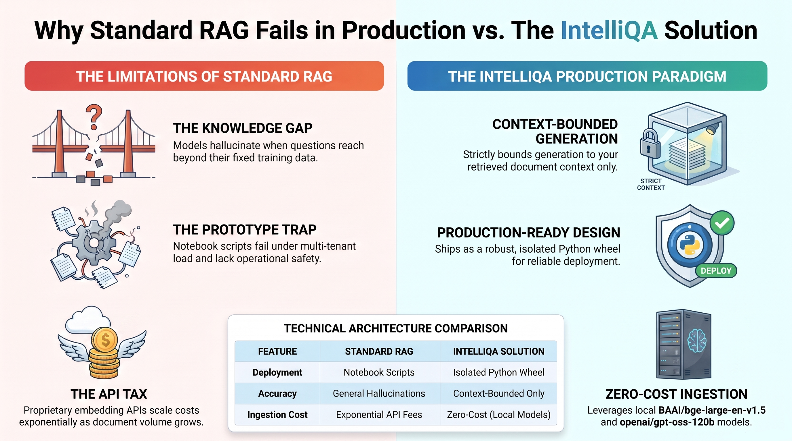
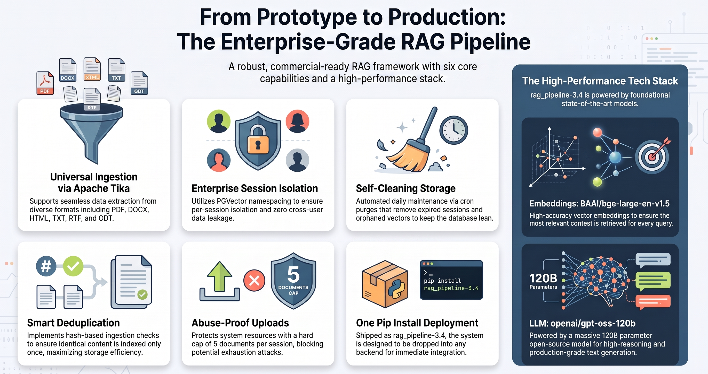
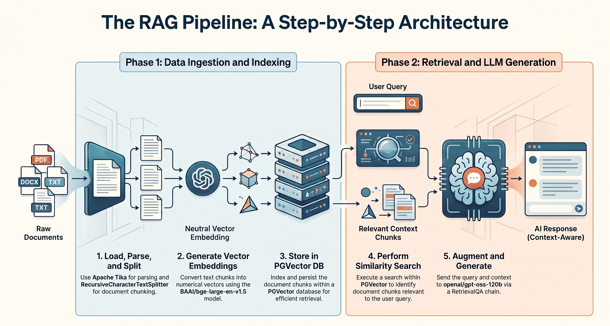

# IntelliQA: Document-Grounded RAG System

<p align="center">
  <a href="https://theanalyticmind.com/projects/intelliqa/">
    
  </a>
  
</p>

IntelliQA is a production-oriented Retrieval Augmented Generation backend for grounded question answering over private documents. Core logic ships as a Python wheel (`rag_pipeline`), so the same package powers a notebook demo, a live portfolio site, and an API service without rewrites.

Sessions are isolated so there is no cross-user leakage, uploads are capped and deduplicated, and a scheduled cron job manages storage. The model answers only from retrieved chunks at `temperature=0` and refuses when context is insufficient. Retrieval quality is not asserted, it is **measured** with a RAGAS evaluation harness that drives every tuning decision below.

> **The driving question:** how do you make LLM answers reliable, multi-tenant, and operationally sustainable on private documents?

## Problem Statement

<p align="center">
  
</p>

## Tech Stack

<div align="center">

| Category | Technology |
| :--- | :--- |
| **LLM & Inference** |   |
| **Embeddings** |   |
| **Reranking** |  |
| **RAG Framework** |  |
| **Vector Store** |   |
| **Document Parsing** |  |
| **Evaluation** |  -8E75FF?style=flat&logo=googlegemini&logoColor=white)  |
| **Deployment** |   |
| **Packaging** |  |

</div>

## Key Features

<p align="center">
  
</p>

## Architecture

At its core, IntelliQA wraps four stages into one installable pipeline: a parser converts documents to text, an embedder converts text to vectors, a vector store holds them for similarity search, and an LLM generates answers grounded in the retrieved chunks. The production system adds operational layers around that core.

**Ingestion** &nbsp;·&nbsp; Apache Tika (long-lived server) parses PDF, Word, and PowerPoint. Structured formats are handled by dedicated loaders: HTML and Markdown split on their heading structure, code splits on language boundaries, and spreadsheets load row-wise so each row is a self-describing chunk. Text is normalized, deduplicated by content hash, and chunked before vectors touch the store.

**Storage** &nbsp;·&nbsp; PGVector on Supabase persists 1024-dimensional vectors from `bge-large-en-v1.5`. Similarity uses cosine distance. Tenant isolation is enforced by a `session_id` in each chunk's metadata, filtered at retrieval time.

**Retrieval** &nbsp;·&nbsp; Dense similarity search retrieves a wide candidate set (`k=20`), then a cross-encoder reranker (`BAAI/bge-reranker-base`) reorders and trims it to the top-N before generation.

**Generation** &nbsp;·&nbsp; GPT-OSS 120B (served on Groq LPU) at `temperature=0`, prompted to answer only from retrieved context and to refuse when the context is insufficient.

**Operations** &nbsp;·&nbsp; Session lifecycle, per-session upload quotas, and a daily cron job for cleanup.

<p align="center">
  
</p>

## Evaluation

RAG quality is measured with a [RAGAS](https://github.com/explodinggradients/ragas) harness built on four metrics, so every component change (chunk size, retrieval `k`, embeddings, reranking) can be compared against a fixed baseline rather than guessed at.

| Metric | What it measures |
|:---|:---|
| **Faithfulness** | Does the answer follow from the retrieved chunks? *(generation grounding)* |
| **Answer Relevancy** | Does the response actually address the question? *(generation quality)* |
| **Context Precision** | Of the chunks retrieved, what fraction are relevant? *(retrieval ranking)* |
| **Context Recall** | Of the chunks needed to answer, how many were retrieved? *(retrieval coverage)* |

**Harness.** ~50 synthetic question-answer pairs generated with RAGAS over a deliberately diverse corpus (financial filings, tax publications, legal agreements, medical and structural engineering papers) to mirror the arbitrary documents a real user might upload. Each question is answered by the live pipeline; retrieved chunks, generated answer, and reference are scored by an LLM judge (Gemini Flash-Lite), with results checkpointed to JSONL so long runs survive rate limits.

### The finding that mattered most: the test set was the bug

Early scores looked poor, with answer relevancy near `0.31` and recall stuck no matter how `k` was raised. The instinct was to keep tuning retrieval. The data said otherwise.

The auto-generated questions were **vague by construction**. Generated one chunk at a time, they never named the entity they were about, asking things like *"what is the unrecognized tax benefit?"* against a corpus holding many near-identical filings. No retriever can resolve that, and RAGAS answer relevancy penalizes vague questions mechanically, since it reverse-generates questions from the answer and compares them to the original.

The fix was to rebuild the test set: generate per document so the source entity is known, then rewrite each question to name it. **Answer relevancy roughly doubled with zero changes to the RAG itself**, proving the low scores were a measurement artifact, not a retrieval failure.

The lesson generalizes: an evaluation set is a first-class artifact, and it needs validating before you trust a single number it produces.

### Retrieval tuning against the rebuilt test set

With a test set that could be trusted, one variable was changed at a time.

| Config | Context Precision | Context Recall | Faithfulness | Answer Relevancy |
| :--- | :---: | :---: | :---: | :---: |
| `k=4` (baseline) | 0.364 | 0.495 | 0.729 | 0.703 |
| `k=10` | 0.352 | 0.629 | 0.716 | 0.788 |
| `k=15` | 0.348 | 0.642 | 0.685 | **0.819** |
| `k=20` | 0.348 | **0.707** | **0.736** | 0.800 |
| `k=20` + rerank top-5 | **0.412** | 0.539 | 0.725 | 0.775 |
| `k=20` + rerank top-8 | 0.410 | 0.629 | 0.729 | 0.759 |
| `k=20` + rerank top-8, overlap 256 | 0.395 | 0.667 | 0.707 | **0.847** |

*Scores are averaged over 50 evaluation questions on the rebuilt index with `hnsw.ef_search = 200`. The final row is the current operating point.*

**What this shows:**

- **Recall climbs with `k` while precision stays flat (~0.35).** Retrieval finds the answer-bearing chunks when given room, but cannot rank them to the top. Flat precision across a 5x change in `k` is both the textbook signal for a reranker and a property of the metric: context precision is an order-aware, Average-Precision-style score normalized by the number of relevant chunks rather than by `k`, so it measures ranking quality, not retrieval depth.
- **The reranker lifts precision (`0.348` → `0.412`) at the cost of recall (`0.707` → `0.539`).** A reranker reorders what retrieval found, it cannot recover what retrieval missed, so `top_n` is a precision-versus-context knob, not a recall lever.
- **Raising `top_n` from 5 to 8 recovers recall for free** (`0.539` → `0.629`) with precision effectively unchanged (`0.412` → `0.410`). Top-8 is the current operating point: it keeps the precision gain over raw `k=20` while returning most of the recall.
- **Precision is treated as a cost and latency diagnostic, not a quality gate.** Faithfulness and answer relevancy hold steady as context grows, meaning the generator ignores retrieved noise rather than being misled by it. Faithfulness and recall are what get gated on.
- **Raising chunk overlap from 5% to 25% lifted recall and relevancy.** At the operating config, moving overlap from 50 to 256 characters raised recall from 0.63 to 0.67 and answer relevancy from 0.76 to 0.85, since facts near a chunk boundary now appear in two adjacent chunks and are less likely to be missed. Precision stayed inside its floor and faithfulness held, so the change is a clean win on the metrics that move.

> Every row above is one variable changed against a frozen test set. That discipline, not any single score, is the point of the harness.

**A note on context precision.** Precision sits near 0.35 to 0.41 across every configuration and barely moves when `k`, reranking, hybrid search, or the index parameters change. When a metric is that stable against that many interventions, it is measuring something upstream of retrieval. The likely cause is the test set itself: its reference answers were generated by a small model (Qwen2.5 7B) and are narrow, so genuinely relevant chunks get scored as irrelevant when they do not match the thin reference. Regenerating the set with a stronger model is in progress to confirm this.

### What was tested and rejected

Not every standard technique earned its place. **Hybrid retrieval** (dense + PostgreSQL full-text search, fused with reciprocal rank fusion) was implemented and evaluated behind a config flag, and it did not help on this corpus: recall and faithfulness dropped slightly while precision stayed flat. The questions here are semantic rather than exact-term lookups, so the sparse signal added noise rather than recall. It stays in the codebase as a toggle for corpora where exact-term matching matters, but it is off by default because the evaluation said so.

## Installation & Usage

### Option 1: Install the prebuilt wheel

Use this if you want IntelliQA as a ready-to-use RAG backend. This is the path the live site uses.

```bash
git clone https://github.com/abhijitdeshpande83/IntelliQA-RAG-Powered-Document-Intelligence.git
cd IntelliQA-RAG-Powered-Document-Intelligence
pip install dist/rag_pipeline-3.3-py3-none-any.whl
```

Set credentials in a `.env` file at the project root:

```bash
GROQ_API_KEY="your-groq-key"
DATABASE_URL="your-postgres-connection-string"
```

Then import and use:

```python
from rag_pipeline.query_engine import load_data, vectorstore, ask_question, is_supported_file

chunks = load_data("report.pdf", session_id="abc123", file_name="report.pdf")
store = vectorstore(documents=chunks)
answer = ask_question("What was the reported revenue?", store, session_id="abc123")
```

The package exposes:

- `rag_pipeline.config`: model names and tuning defaults (`k`, `top_n`, chunk size)
- `rag_pipeline.utils`: parsing, format-aware chunking, deduplication
- `rag_pipeline.vector_store`: PGVector setup and indexing
- `rag_pipeline.retrievers`: dense, full-text, hybrid, and reranking retrievers
- `rag_pipeline.query_engine`: retrieval orchestration, prompt assembly, generation

See `IntelliQA.ipynb` for end-to-end examples.

### Option 2: Install from source

Use this to read, modify, or extend the core RAG logic.

```bash
git clone https://github.com/abhijitdeshpande83/IntelliQA-RAG-Powered-Document-Intelligence.git
cd IntelliQA-RAG-Powered-Document-Intelligence

python -m venv venv
source venv/bin/activate              # Windows: venv\Scripts\activate

pip install -r requirements.txt
pip install -e .

jupyter notebook IntelliQA.ipynb
```

### Database indexes (required after first ingestion)

PGVector creates the tables on first insert but does not create indexes. After loading data, create them once so retrieval is fast and hybrid search works. Full setup, including the exact SQL, is documented in [issue #19](https://github.com/abhijitdeshpande83/IntelliQA-RAG-Powered-Document-Intelligence/issues/19). In short:

- **HNSW index on the embedding column** using `vector_cosine_ops` (cosine distance, matching the normalized `bge-large` embeddings). Without it, every query scans the whole table.
- **`hnsw.ef_search` must be raised from its default of 40.** HNSW is an approximate index, and the default explores too little of the graph for `k=20`, which measurably lowers recall versus exact search. It is set at the role or database level (`ALTER ROLE ... SET hnsw.ef_search = 200`) so every connection inherits it. Note the parameter only registers after pgvector is loaded in the session.
- **GIN index on a generated `tsvector` column** for the full-text (sparse) side of hybrid search.

## Challenges & Lessons Learned

**A vector database gives you storage, not retrieval quality.**
Migrating from ChromaDB to raw PGVector meant owning the index layer a managed store hides. Queries silently ran brute-force scans over every embedding until they grew slow enough to time out. Adding an HNSW index fixed the scan, but HNSW is approximate: at the default `ef_search` of 40, recall dropped versus exact search, and raising it to 200 was needed to recover. The index and its search parameters are yours to own and tune.

**Every ingestion path must end in a size guarantee.**
A single character splitter is not enough for arbitrary uploads. HTML and Markdown arrived through Tika with their heading structure already stripped, so a header-based splitter saw no headers and returned a whole document as one chunk. A spreadsheet loaded as a whole sheet became one 7,000-character chunk that blew the generation token budget. Each format needed its own path (raw read plus structure-aware splitting for HTML and Markdown, row-wise loading for spreadsheets), and every path needed a recursive size cap as a backstop, because a specialized loader will eventually hand you something oversized.

**Spreadsheets are a lookup tool, not an analytics tool.**
Row-wise chunking answers "find the record where X" but structurally cannot answer "what is the total" or "which is highest," because no single retrieved chunk holds the answer and vector search cannot aggregate. This is a documented limitation, not a bug. The honest fix for analytical questions is a text-to-SQL layer, which is out of scope for a document-QA system.

**Choose the replacement model with the harness, not the reputation.**
When the generation model (Groq's Llama 3.3 70B) was scheduled for retirement, the pipeline moved to GPT-OSS 120B. The replacement was picked by re-running the evaluation harness on the new model, not by benchmark reputation, and the switch was clean because generation was already isolated behind a factory function.

**Clean extraction is a retrieval concern, not cosmetics.**
Raw Tika output carried tabs, non-breaking spaces, PDF hyphenation splits (`vesi-\ncles`), and soft line breaks mid-sentence. Split words and broken sentences fail to match at retrieval time. Normalizing text before chunking is a small change with a direct effect on embedding quality, and it was only visible because the eval harness surfaced the retrieval failures.

**Over-refusal was a prompt problem, not a noise problem.**
The default RetrievalQA prompt was too conservative, refusing whenever the answer was not stated word-for-word. Cleaning the text did not reduce refusals. Rewriting the prompt to permit partial and rephrased context did.

**Tika is fast when warm, slow when treated like a CLI tool.**
Spawning a fresh JVM per request caused unacceptable cold-start latency. Running a long-lived Tika server and proxying to it cut parse time from seconds to milliseconds.

## Status

| Stage | Details |
| :--- | :--- |
| **Shipped** | Core pipeline, session isolation, upload quotas, deduplication, scheduled cleanup, PGVector migration with HNSW indexing, `bge-large` embeddings, GPT-OSS 120B generation, cross-encoder reranking, format-aware chunking, AWS EC2 deployment, `rag_pipeline-3.3` wheel, RAGAS evaluation harness with a rebuilt and validated test set |
| **In progress** | Regenerating the evaluation test set with a stronger generator model (GPT-OSS 120B) to test whether the flat context precision (~0.35 to 0.41) is a measurement artifact. The current set was generated by a small model (Qwen2.5 7B), whose narrow reference answers appear to floor precision regardless of retrieval quality. The new run is rate-limited and generating in batches, so it is ongoing. |
| **Next** | Contextual retrieval to preserve parent context within chunks; parent-document retrieval to resolve the recall-versus-context tradeoff structurally; inline citations linking answers to source chunks |